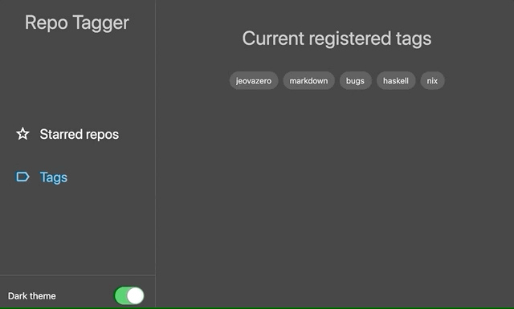

# Repo tagger

A tagger application for github repositories

It's meant to be a usable application, but also a personal
experiment on new technologies.

It may be available at:
https://repo-tagger.herokuapp.com/

Note: I'm not persisting any data, I'm using an in memory
DB to avoid heroku limitations, so don't expect your data
to be there forever.



## What it does?

It let's you add personal tags to starred repositories
and query them by those tags.


## Running docker

If you have docker, you can build & run the app with:

```shell script
docker build -t repo-tagger .
docker run -m512M --cpus 2 -it --env-file ./.env -p 8080:8080 --rm repo-tagger
```

Note: be sure to create the `.env` file with needed variables, they 
are explained on `.env.example`, you can also use `.env.dev`
if you wish.

## Languages and frameworks

For frontend, I've chosen to use dart + flutter web,
flutter is not really ready for production web apps (IMHO),
but it's pretty good to develop something in it.

For backend, I've chosen to use kotlin + ktor + exposed (yeah, I
like jetbrains, how did you know?). Everything works really well, but exposed 
lacks docs and is kinda confusing, except for that, it is not so hard do develop 
a server with this stack.
